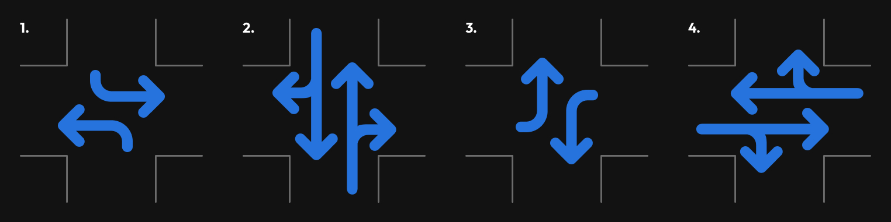

# AVS intelligent traffic control system

## Overview

## Functional Requirements Fulfilled
- Realistic four-way intersection simulation with four approaches: **north, south, east, and west**
- Vehicles can perform the following manoeuvres: **left turn, right turn, and going straight**
- Vehicles are placed into queues based on their entry direction
- The system assigns green lights to non-colliding traffic routes using predefined route groups
- Traffic priority is based on how long a vehicle has been waiting at the intersection
- Colliding-free signal phases are ensured — no colliding routes receive green lights at the same time

## Additional Features
- Emergency vehicle preemption is implemented: emergency vehicles get immediate passage regardless of queue position

## Simulation Algorithm

1. The algorithm accepts two file paths as input: `input.json` and `output.json`
2. These paths are validated to ensure they point to `.json` files. If validation fails, an exception is thrown and the program terminates.
3. The `input.json` file contains an array of commands. The program iterates over each command and executes the appropriate action described below.

### addVehicle Command
This command creates a vehicle in the **virtual environment** and appends it to the queue corresponding to the specified origin direction (eg. north, south, etc.). In addition to the fields provided in the input, the algorithm dynamically assigns three new properties to the vehicle:

| Fields             	| Type       	| Origin     	| Description                                                         	|
|--------------------	|------------	|------------	|---------------------------------------------------------------------	|
| vehicleId          	| string     	| input.json 	| determines the vehicle ID                                           	|
| startRoad          	| string     	| input.json 	| determines vehicle origin                                           	|
| endRoad            	| string     	| input.json 	| determines vehicle destination                                      	|
| waitTime           	| number     	| runtime    	| time the vehicle spends at the crossroad, used to determine priority 	|
| isEmergencyVehicle 	| boolean    	| runtime    	| emergency vehicle status, used to determine priority                 	|
| manoeuvre          	| Manoeuvres 	| runtime    	| assigned dynamically to enhance the system workflow                  	|

Sample input:
```json
{
      "type": "addVehicle",

      "vehicleId": "vehicle1",

      "startRoad": "south",

      "endRoad": "north"

},
```

### step Command
Runs the simulation step for the **virtual environment**.

1. The system begins by updating the current traffic light cycle. All `YELLOW` lights from the previous step are transitioned to `RED`.
2. The `leftVehicles[]` array is initialized to track vehicles that will leave the intersection during this step.
3. The system performs arbitration to determine vehicle priority. Priority is assigned based on the longest wait time (waitTime), unless an emergency vehicle is present, in which case it takes precedence.
4. Once a single priority vehicle is selected, the system determines its intended manoeuvre and selects a traffic pattern group that accommodates it. See [Traffic Control Algorithm](https://github.com/jzielinski47/avs-inteligent-traffic-control/edit/main/readme.md#traffic-control-algorithm)
5. All signals corresponding to the selected traffic pattern group are set to `GREEN`. As the group contains only non-conflicting routes, multiple vehicles may proceed simultaneously if their manoeuvres match the active green signals.
6. Each vehicle is evaluated for movement. If the signal for its manoeuvre is `GREEN`, it is allowed to proceed. Emergency vehicles are always allowed to pass, but the system ensures that a green signal is provided for them regardless.
7. All vehicles that successfully pass through the intersection during this step are added to the leftVehicles[] array, which is then stored in the simulation output.
8. Finally, the system updates the traffic light cycle again: all lights currently set to `GREEN` are transitioned to `YELLOW`, preparing for the next phase.

Sample input:
```json
{
      "type": "step",
},
```


## Traffic Control Algorithm

I thought of a system that relies on the time the vehicle waits at the crossroad.
The priority is assigned to the vehicle that has waited the longest, with an exception for Emergency vehicles.

The traffic is considered in four non-colliding route patterns:


```ts
[
    [
        { startRoad: Direction.SOUTH, endRoad: Direction.WEST, type: Manoeuvres.LEFTTURN },
        { startRoad: Direction.NORTH, endRoad: Direction.EAST, type: Manoeuvres.LEFTTURN },
    ],
    [
        { startRoad: Direction.SOUTH, endRoad: Direction.EAST, type: Manoeuvres.RIGHTTURN },
        { startRoad: Direction.SOUTH, endRoad: Direction.NORTH, type: Manoeuvres.STRAIGHT },
        { startRoad: Direction.NORTH, endRoad: Direction.WEST, type: Manoeuvres.RIGHTTURN },
        { startRoad: Direction.NORTH, endRoad: Direction.SOUTH, type: Manoeuvres.STRAIGHT },
    ],
    [
        { startRoad: Direction.WEST, endRoad: Direction.NORTH, type: Manoeuvres.LEFTTURN },
        { startRoad: Direction.EAST, endRoad: Direction.SOUTH, type: Manoeuvres.LEFTTURN },
    ],
    [
        { startRoad: Direction.WEST, endRoad: Direction.SOUTH, type: Manoeuvres.RIGHTTURN },
        { startRoad: Direction.WEST, endRoad: Direction.EAST, type: Manoeuvres.STRAIGHT },
        { startRoad: Direction.EAST, endRoad: Direction.NORTH, type: Manoeuvres.RIGHTTURN },
        { startRoad: Direction.EAST, endRoad: Direction.WEST, type: Manoeuvres.STRAIGHT },
    ],
];
```

The priority is assigned to the vehicle in its turn, and the route matching the vehicle's desired manoeuvre is opened. Simultaneously, all non-colliding routes for that path are opened, and different vehicles awaiting their turn can proceed if their manoeuvre matches with the green light.

### Example behaviour

Input JSON:

```json
{
    "commands": [
        {
            "type": "addVehicle",

            "vehicleId": "vehicle1",

            "startRoad": "north",

            "endRoad": "east"
        },
        {
            "type": "addVehicle",

            "vehicleId": "vehicle2",

            "startRoad": "south",

            "endRoad": "west"
        },
        {
            "type": "step"
        },
        {
            "type": "step"
        }
    ]
}
```

Example stage before arbitration:

```json
{
  "north": {
    "priorityLeftSignalLight": "red",
    "straightRightSignalLight": "red",
    "queue": [ [Object] ]
  },
  "east": {
    "priorityLeftSignalLight": "red",
    "straightRightSignalLight": "red",
    "queue": []
  },
  "south": {
    "priorityLeftSignalLight": "red",
    "straightRightSignalLight": "red",
    "queue": [ [Object] ]
  },
  "west": {
    "priorityLeftSignalLight": "red",
    "straightRightSignalLight": "red",
    "queue": []
  }
}
```

At this stage, the Traffic Control System assigned priority to vehicle1 which has waited 2 rounds at the time of arbitration. The left protected arrow has been set to green light on both sides. See Scenario 1.

Two individual instances of vehicle (vehicle1, vehicle2) leave the corssroad simultaniously as the signal for their manouevre is green.

Console output:

```console
vehicle1 leaves the crossroad!
vehicle2 leaves the crossroad!
```

Example stage after arbitration:

```json
{
    "north": {
        "priorityLeftSignalLight": "green",
        "straightRightSignalLight": "red",
        "queue": []
    },
    "east": {
        "priorityLeftSignalLight": "green",
        "straightRightSignalLight": "red",
        "queue": []
    },
    "south": {
        "priorityLeftSignalLight": "green",
        "straightRightSignalLight": "red",
        "queue": []
    },
    "west": {
        "priorityLeftSignalLight": "green",
        "straightRightSignalLight": "red",
        "queue": []
    }
}
```

Output JSON:

```json
{
    "stepStatuses": [
        {
            "leftVehicles": [
                "vehicle1", 
                "vehicle2"
            ]
        },
        {
            "leftVehicles": [

            ]
        }
    ]
}
```

## Emergency Vehicle Preemption

When the system detects that an emergency vehicle appears at the crossroad, all lights instantly change the priority to let the emergency vehicle pass safely. This approach is a common practice in the United States to improve emergency response times. For further details, see: https://en.wikipedia.org/wiki/Traffic_signal_preemption

In order to simulate the emergency vehicle, add a vehicle with ID that contains word `emergency`


As demonstrated in the example above, although the **vehicle** originating from the **north** has been waiting longer than the **emergency vehicle** coming from the **south**, priority is given to the **emergency vehicle** to ensure immediate passage regardless of the queue position. On the right, you can see the Emergency Vehicle passing before the cars that have higher priority (based on the waiting time).
